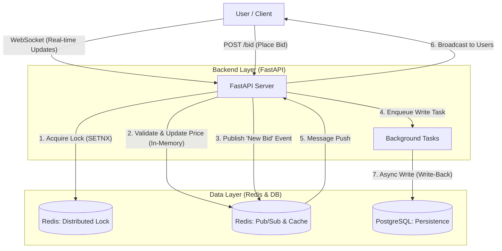
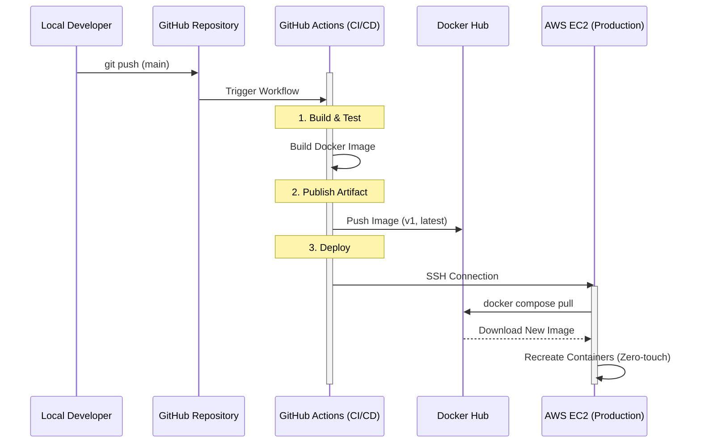
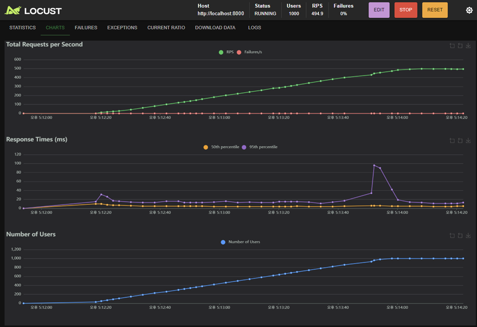

# ⚡ realtime-auction-backend


- Design target: 10,000+ concurrently connected users

- Load test target: 1,000+ bid requests per second (TPS) on a single node


> A high-availability backend system designed for **real-time auctions (Live Auction)**,  

> focusing on **data consistency** and **low latency** under heavy concurrent traffic.


---


## 📖 1. Project Overview


In real-time auction scenarios such as **first-come-first-served bidding**, thousands of requests can hit the system within milliseconds.  

Without proper concurrency control, this easily leads to:


- Race conditions

- Inconsistent states (e.g., double winners, overwritten prices)

- Over-selling or invalid winning bids


This project aims to solve these problems by combining:


- **Redis-based Distributed Locking**

- **Event-Driven Architecture**

- **Asynchronous, non-blocking I/O**


The primary goals are:


- Maintain **strong data consistency** under high concurrency

- Achieve **low latency** bid processing


### 🎯 Key Engineering Goals


1. **Concurrency Control**  

   Use a Redis-based distributed lock to serialize critical sections and  

   keep bid-related data consistency as close to **100%** as possible under concurrent access.


2. **Real-time Interaction**  

   Use **WebSocket** + **Redis Pub/Sub** to broadcast bid updates to all connected clients  

   with minimal latency.


3. **Non-blocking I/O**  

   Leverage FastAPI's **async/await** capabilities to reduce blocking I/O and  

   handle more concurrent connections on the same hardware.


> ⚠️ **Note**  

> These are design targets. Actual performance and consistency guarantees will be verified  

> via load testing (Locust) and updated in this README.


---


## 🏗️ 2. System Architecture


The system is designed around:


- **Asynchronous processing**

- **Write-behind (async persistence)** strategy

- **In-memory locking and caching** to offload pressure from the database





### 🔄 Workflow Description


1. **Bid Request (Bidding)**  

   - The client sends a bid request to the REST endpoint, e.g. `POST /bid`.


2. **Concurrency Control (Locking)**  

   - Single-Redis based lock (SETNX + expiration).

   -  Redlock was intentionally not adopted due to its complexity and debated safety guarantees.

   - **Only one request that acquires the lock** can enter the critical section for that item.


3. **In-memory Processing**  

   - The current highest bid is stored in Redis.

   - The server validates the new bid and updates the in-memory state (price, bidder, timestamp, etc.).

   - This avoids direct disk I/O in the hot path and reduces latency.


4. **Real-time Broadcasting**  

   - After an in-memory update, the server publishes a `"New Bid"` event to a Redis Pub/Sub channel.

   - The API server (or a dedicated subscriber) listens to that channel and pushes updates

     to all connected WebSocket clients in real time.


5. **Asynchronous Persistence (Write-Back)**  

   - A background task (e.g. FastAPI `BackgroundTasks` or a dedicated worker)  

     consumes queued write operations.

   - It writes the final bid state to PostgreSQL **asynchronously**, outside of the request/response cycle.

   - The API returns the bid result (success/failure) without waiting for the DB write to complete,  

     improving response time while still ensuring persistence shortly after.


---
## 🚀 3. CI/CD & Cloud Infrastructure

To ensure reliability and rapid iteration, I constructed a fully automated deployment pipeline replacing manual SSH operations. The system adheres to the 12-Factor App methodology, strictly separating configuration (secrets) from code.



## 🛡️ Security Engineering (Secret Management)
Directly managing docker-compose.yml with hardcoded credentials poses a significant security risk. I implemented a Dynamic Environment Injection strategy:

Storage: All sensitive data (DB passwords, API keys) are encrypted and stored in GitHub Secrets.

Injection: During the CD phase, GitHub Actions dynamically generates a ephemeral .env file on the EC2 instance.

Result: No sensitive data exists in the source code or the Docker image, minimizing the attack surface. 

---
## 📊 4. Performance Goals (KPIs)


Using Locust, the system will be stress-tested with realistic user flows and traffic patterns.  

The following metrics are **design targets** for the overall architecture:


| Metric        | Target Goal     | Description                                                        |
|--------------|-----------------|--------------------------------------------------------------------|
| Throughput   | **1,000+ TPS**  | Sustainably handle 1,000+ bid requests per second on a single node |
| Latency P99  | **< 200 ms**    | 99% of requests should complete within 200 ms                      |
| Consistency  | **≈ 100%**      | Zero over-selling / double-winning bids under concurrent test load |


> 📌 **Planned Benchmarks vs. Verified Results**  
> - Design targets are defined above (10,000+ concurrent users, 1,000+ TPS).  
> - Verified results from Locust load testing on a single node are documented in the **Load Testing (Locust)** section below.  
> - For 10,000+ concurrent users, the system is designed to scale horizontally (multiple FastAPI instances behind a load balancer, Redis as shared coordination layer), but this scale has not been empirically tested on local hardware.


---


## 🛠️ 5. Tech Stack & Rationale


| Category  | Tech             | Why Selected?                                                                 |
|-----------|------------------|-------------------------------------------------------------------------------|
| Language  | Python 3.10      | Fast prototyping, mature `asyncio` ecosystem                                |
| Framework | FastAPI          | High-performance async I/O, type hints, great DX (vs Flask/Django)          |
| Database  | PostgreSQL 15    | Reliable ACID guarantees, strong support for transactional integrity        |
| Cache/Msg | Redis            | In-memory speed for locking and Pub/Sub-based real-time messaging           |
| Protocol  | WebSocket        | Bi-directional, low-overhead real-time communication vs polling/long-poll   |
| Testing   | Locust           | Python-based load testing with scenario scripting support                   |
| DevOps    | Docker Hub, GitHub Actions, AWS EC2 | **Automated CI/CD pipeline** for zero-downtime deployment & immutable infrastructure |


---


## 🚧 6. Roadmap (To-Do)


- [x] Domain modeling for core entities (Auction, Bid, User, etc.)

- [x] Implement bid API (`POST /bid`) with Redis-based distributed locking

- [x] Implement WebSocket endpoint for real-time bid updates

- [x] Implement async persistence (write-behind) from Redis cache to PostgreSQL using FastAPI `BackgroundTasks`

- [x] Design and run Locust load test scenarios, then document results here


---


## 🔮 7. Future Improvements

- [ ] Horizontal Scaling: Deploy multiple API instances behind a Load Balancer (Nginx) to support 10,000+ users.

- [ ] Message Queue: Replace background tasks with Kafka/RabbitMQ for better reliability.


---


## 🚀 8. Getting Started

### Option 1: Run with Docker Compose

```bash
docker-compose up -d --build
```

- API base URL: `http://localhost:8000`
- Interactive API docs (Swagger UI): `http://localhost:8000/docs`

To stop all containers:

```bash
docker-compose down
```


### Option 2: Run locally (without Docker)

1. Start PostgreSQL and Redis (locally or via containers).
2. Install dependencies:

```bash
pip install -r requirements-dev.txt
```

3. Run the application:

```bash
uvicorn app.main:app --host 0.0.0.0 --port 8000
```

- API base URL: `http://localhost:8000`
- Interactive API docs (Swagger UI): `http://localhost:8000/docs`


### Run Locust load tests

```bash
locust -f tests/locustfile.py --host http://localhost:8000
```

Then open `http://localhost:8089` in your browser to start a load test.


---


## 📈 9. Load Testing (Locust)

To validate the concurrency control and throughput of the bidding API, the system was load tested using Locust.



### Test Scenario

- Target endpoint: `POST /api/v1/bid`
- Virtual users: **1,000** concurrent users
- User behavior:
   - Each user repeatedly submits bids for the same auction item
   - Bid amount is randomized within a configured price range
   - Think time between requests: 1–3 seconds (`wait_time = between(1, 3)`)
- Concurrency control: Redis-based distributed lock around the critical section


### Test Environment

- Application stack: FastAPI + Uvicorn, Redis, PostgreSQL
- Deployment: Single FastAPI application instance
- Redis and PostgreSQL: Docker containers
- Load generator: Locust running on the same machine as the application


### Results (example run)

- Concurrent users: **1,000**
- Peak throughput: **≈ 495 requests/second (RPS)**
- Failures: **0%**
- Latency:
   - Median (p50): generally in the low **tens of milliseconds**
   - 95th percentile (p95): mostly below **~100 ms**, with a short spike during ramp-up


### Interpretation

- The system can sustain ~500 bid requests per second on a single node with **zero errors**, while preserving data consistency via the Redis-based distributed lock.
- Short p95 latency spikes during ramp-up are expected as connections are established; latency stabilizes once the system reaches a steady state.
- These results validate the architectural choices (async FastAPI, Redis locking, in-memory processing with asynchronous persistence) for high-concurrency bidding workloads on a single node. Horizontal scaling (multiple application instances behind a load balancer) can further increase the number of concurrently connected users toward the design targets.
