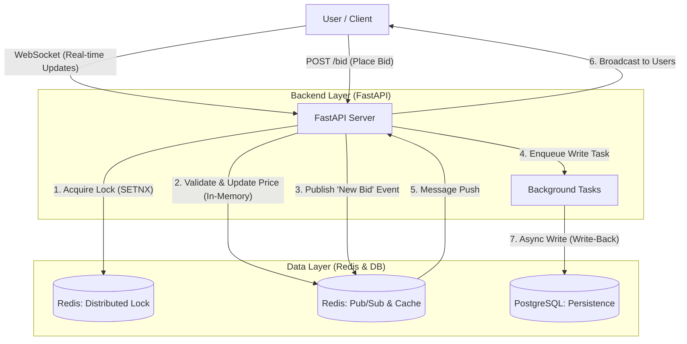

# ⚡ realtime-auction-backend

- Design target: 10,000+ concurrently connected users

- Load test target: 1,000+ bid requests per second (TPS) on a single node

> A high-availability backend system designed for **real-time auctions (Live Auction)**,  

> focusing on **data consistency** and **low latency** under heavy concurrent traffic.

---

## 📖 1. Project Overview

In real-time auction scenarios such as **first-come-first-served bidding**, thousands of requests can hit the system within milliseconds.  

Without proper concurrency control, this easily leads to:

- Race conditions

- Inconsistent states (e.g., double winners, overwritten prices)

- Over-selling or invalid winning bids

This project aims to solve these problems by combining:

- **Redis-based Distributed Locking**

- **Event-Driven Architecture**

- **Asynchronous, non-blocking I/O**

The primary goals are:

- Maintain **strong data consistency** under high concurrency

- Achieve **low latency** bid processing

### 🎯 Key Engineering Goals

1. **Concurrency Control**  

   Use a Redis-based distributed lock to serialize critical sections and  

   keep bid-related data consistency as close to **100%** as possible under concurrent access.

2. **Real-time Interaction**  

   Use **WebSocket** + **Redis Pub/Sub** to broadcast bid updates to all connected clients  

   with minimal latency.

3. **Non-blocking I/O**  

   Leverage FastAPI's **async/await** capabilities to reduce blocking I/O and  

   handle more concurrent connections on the same hardware.

> ⚠️ **Note**  

> These are design targets. Actual performance and consistency guarantees will be verified  

> via load testing (Locust) and updated in this README.

---

## 🏗️ 2. System Architecture

The system is designed around:

- **Asynchronous processing**

- **Write-behind (async persistence)** strategy

- **In-memory locking and caching** to offload pressure from the database

### 🔄 Workflow Description

1. **Bid Request (Bidding)**  

   - The client sends a bid request to the REST endpoint, e.g. `POST /bid`.

2. **Concurrency Control (Locking)**  

   - The API server obtains a lock for a specific auction item using Redis (`SETNX` style).

   - **Only one request that acquires the lock** can enter the critical section for that item.

3. **In-memory Processing**  

   - The current highest bid is stored in Redis.

   - The server validates the new bid and updates the in-memory state (price, bidder, timestamp, etc.).

   - This avoids direct disk I/O in the hot path and reduces latency.

4. **Real-time Broadcasting**  

   - After an in-memory update, the server publishes a `"New Bid"` event to a Redis Pub/Sub channel.

   - The API server (or a dedicated subscriber) listens to that channel and pushes updates

     to all connected WebSocket clients in real time.

5. **Asynchronous Persistence (Write-Back)**  

   - A background task (e.g. FastAPI `BackgroundTasks` or a dedicated worker)  

     consumes queued write operations.

   - It writes the final bid state to PostgreSQL **asynchronously**, outside of the request/response cycle.

   - The API returns the bid result (success/failure) without waiting for the DB write to complete,  

     improving response time while still ensuring persistence shortly after.

---

## 📊 3. Performance Goals (KPIs)

Using Locust, the system will be stress-tested with realistic user flows and traffic patterns.  

The following metrics are **design targets**:

| Metric        | Target Goal     | Description                                                        |

|--------------|-----------------|--------------------------------------------------------------------|

| Throughput   | **1,000+ TPS**  | Sustainably handle 1,000+ bid requests per second on a single node |

| Latency P99  | **< 200 ms**    | 99% of requests should complete within 200 ms                      |

| Consistency  | **≈ 100%**      | Zero over-selling / double-winning bids under concurrent test load |

> 📌 **Planned Benchmarks**  

> - Compare performance **before/after** applying Redis locks and caching  

> - Start with a single instance, then consider horizontal scaling scenarios

---

## 🛠️ 4. Tech Stack & Rationale

| Category  | Tech             | Why Selected?                                                                 |

|-----------|------------------|-------------------------------------------------------------------------------|

| Language  | Python 3.10      | Fast prototyping, mature `asyncio` ecosystem                                |

| Framework | FastAPI          | High-performance async I/O, type hints, great DX (vs Flask/Django)          |

| Database  | PostgreSQL 15    | Reliable ACID guarantees, strong support for transactional integrity        |

| Cache/Msg | Redis            | In-memory speed for locking and Pub/Sub-based real-time messaging           |

| Protocol  | WebSocket        | Bi-directional, low-overhead real-time communication vs polling/long-poll   |

| Testing   | Locust           | Python-based load testing with scenario scripting support                   |

---

## 🚧 5. Roadmap (To-Do)

- [ ] Domain modeling for core entities (Auction, Bid, User, etc.)

- [ ] Implement bid API (`POST /bid`) with Redis-based distributed locking

- [ ] Implement WebSocket endpoint for real-time bid updates

- [ ] Implement async persistence (write-behind) from Redis to PostgreSQL

- [ ] Design and run Locust load test scenarios, then document results here
