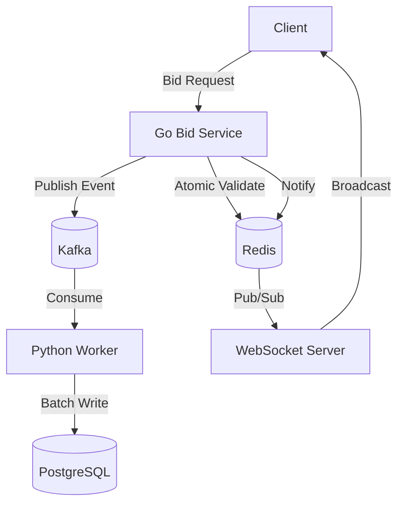
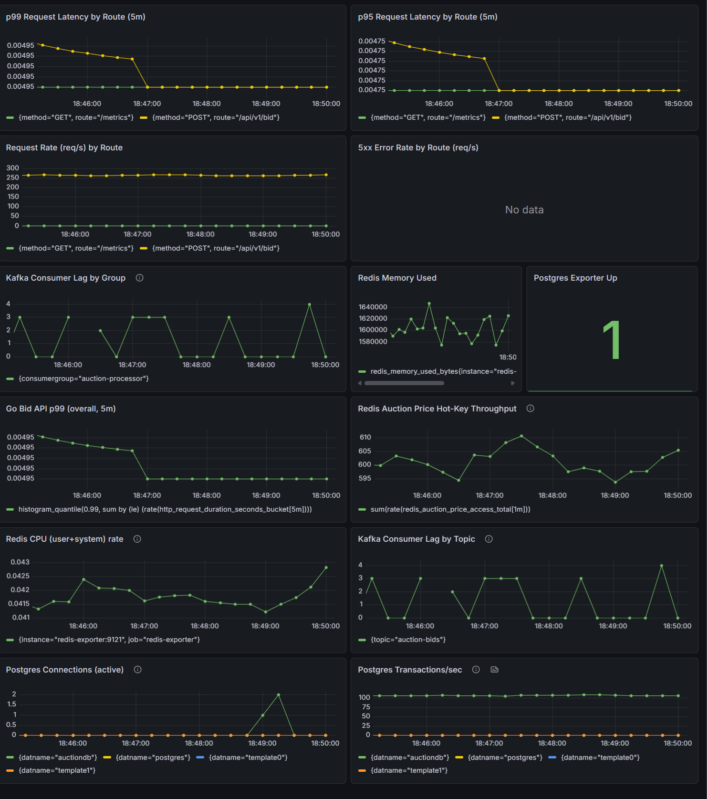
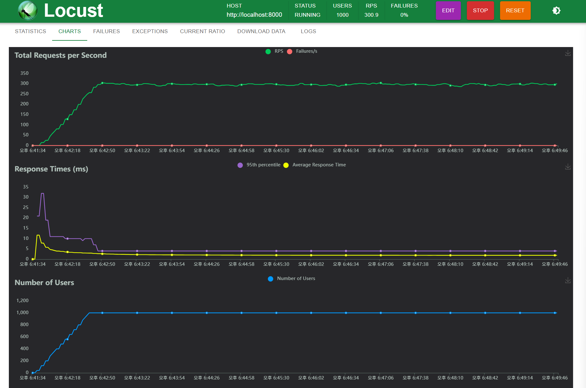

# ⚡ Real-Time Auction Backend
 
> A distributed, event-driven backend system engineered for extreme contention on single auction items ("hot keys").
 
In environments where thousands of bids arrive per second, traditional database-first approaches fail due to locking overhead. This project demonstrates a production-grade solution using **Atomic In-Memory Validation** and **Asynchronous Write-Behind Persistence**.
 
---
 
## 🏗️ System Architecture
 
The system utilizes a **polyglot microservices** approach to optimize for specific workloads: **Go** for high-throughput ingestion and **Python (FastAPI)** for asynchronous broadcasting and background processing.
 

```mermaid
graph TD
    Client[Client]
 
    GoAPI[Go Bid Service]
    Redis[(Redis)]
    Kafka[(Kafka)]
    Worker[Python Worker]
    DB[(PostgreSQL)]
    WS[WebSocket Server]
 
    Client -->|Bid Request| GoAPI
    GoAPI -->|Atomic Validate| Redis
    GoAPI -->|Publish Event| Kafka
    GoAPI -->|Notify| Redis
 
    Redis -->|Pub/Sub| WS
    WS -->|Broadcast| Client
 
    Kafka -->|Consume| Worker
    Worker -->|Batch Write| DB
```
 
---
 
## 🧠 Strategic Engineering Decisions: The "Why"
 
### 1. Why Redis Lua instead of Distributed Locks?
 
In a high-frequency auction, multiple round-trips to acquire and release locks (like Redlock) create massive latency.
 
| | |
|---|---|
| **Intent** | We need Atomic State Transitions. |
| **Choice** | By embedding validation logic in a Lua script, the entire "Check-and-Set" operation happens in a **single atomic step** inside Redis. |
| **Benefit** | Eliminates race conditions entirely without the overhead of network-intensive locking protocols, keeping our **p99 latency sub-100ms**. |
 
### 2. Why a Polyglot MSA (Go + Python)?
 
One size does not fit all. We decoupled the system to leverage the strengths of different ecosystems.
 
| Service | Role | Reason |
|---|---|---|
| **Go** | Ingestion ("Hot Path") | Lightweight goroutines handle thousands of concurrent HTTP connections with minimal memory footprint. |
| **Python** (FastAPI/Worker) | Notifications & Persistence ("Cold Path") | Rich ecosystem ideal for complex batch processing logic and persistent WebSocket connections. |
 
### 3. Why Go Worker Pool with Bounded Queues?
 
Directly calling Kafka for every request can slow down the API if Kafka experiences a momentary lag.
 
- **Design:** The Go service implements a Worker Pool with a **Bounded Task Queue (Size: 1,000)**.
- **Backpressure Handling:** When the queue reaches its depth limit, the system gracefully drops new tasks to protect the service from crashing *(Fail-fast)*.
- **Decoupling:** Separates the critical path (validating the bid) from the non-critical path (persisting the bid), ensuring the user receives an immediate response.
 
### 4. Why Kafka for Persistence?
 
The database is the slowest part of any high-traffic system.
 
- **Intent:** Shield the Database.
- **Choice:** Kafka acts as a massive buffer. The Go Producer sends validated bids to Kafka, and the Python Consumer fetches them in batches.
- **Ordering & Recovery:** Using `AuctionID` as the partition key guarantees all bids for one item are processed **in order**. If the database goes down, Kafka holds the data until it's back online, ensuring **Zero Data Loss**.
 
---
 
## 🛠️ Implementation Details
 
### Go Worker Pool (Producer)
 
| Parameter | Value |
|---|---|
| Queue Depth Limit | 1,000 pending tasks |
| Worker Concurrency | 100 workers (default) |
 
### Python Persistence (Consumer)
 
| Parameter | Value |
|---|---|
| Batch Size | Up to 1,000 records per flush |
| Flush Interval | 1 second max wait |
| Idempotency Strategy | `ON CONFLICT DO NOTHING` with unique `bid_id` (UUID) |
 
---
 
## 🛡️ DevOps & Security Engineering
 
| Area | Implementation |
|---|---|
| **CI/CD** | GitHub Actions — every push to `main` triggers a full build-test-deploy cycle to AWS EC2. |
| **12-Factor Compliance** | Secrets managed via GitHub Secrets, injected into ephemeral `.env` files. No credentials ever touch source code. |
| **Observability** | Health check endpoints across all microservices for container orchestration readiness. |
 
---
 
## 📊 Performance Benchmarks

> Load test conducted with **Locust** (1,000 concurrent users) against the Go Bid Ingestion API.  
> Infrastructure monitored in real-time via **Grafana + Prometheus**.  
> ⚠️ **Test Environment**: All benchmarks were conducted on a local machine (not a production-grade
> cloud environment). Results reflect the system's architectural efficiency rather than absolute
> throughput capacity. Cloud deployment benchmarks are planned.
### Benchmark Screenshots

### Grafana Monitoring Dashboard



### Locust Load Test


### Load Test Summary

| Metric | Result |
|---|---|
| **Concurrent Users** | 1,000 |
| **Sustained RPS** | ~300.9 req/s |
| **Failure Rate** | 0% |
| **p99 Latency (Go Bid API)** | ~4.95 ms |
| **p95 Latency (Go Bid API)** | ~4.75 ms |
| **p95 Ramp-up Spike** | ~32 ms (stabilizes within ~2 min) |
| **Avg Response Time (stable)** | < 2 ms |
| **Redis Hot-Key Throughput** | ~595–610 ops/s |
| **Kafka Consumer Lag (max)** | 4 messages |
| **PostgreSQL Active Connections** | ≤ 2 |
| **PostgreSQL TPS** | ~100 tps |
| **5xx Error Rate** | 0 |

### Key Observations

- **Zero failures** across the entire ~8-minute sustained load test at 1,000 concurrent users.
- **Sub-5ms p99** held consistently after ramp-up, validating that atomic Lua + in-memory
  validation is not the bottleneck at this load level.
- **Ramp-up spike reduced to ~32ms** (from ~40ms in previous run) — consistent with Go Worker
  Pool saturation resolving as goroutines catch up, not a Redis or DB issue.
- **Kafka Consumer Lag capped at 4 messages** — Python worker maintained pace with the Go
  producer under sustained 300+ RPS.
- **PostgreSQL shielded entirely from bid traffic** — only ≤2 active connections and ~100 TPS
  observed, confirming the Kafka write-behind buffer absorbed all load as designed.
- **Redis memory stable** at 1.58–1.64 MB with no unbounded growth throughout the test.

### Bottleneck Analysis

| Component | Assessment | Rationale |
|---|---|---|
| **Go Worker Pool → Kafka produce** | Primary bottleneck candidate | Bounded queue (1,000) triggers fail-fast under burst; visible as p95 spike (~32ms) during ramp-up before stabilizing |
| **Python Worker → PostgreSQL** | Secondary bottleneck | Batch flush interval (1s) couples DB write latency to Kafka lag oscillation (0–4 msgs) |
| **Redis Lua hot-key** | Not a bottleneck | Throughput stable at ~595–610 ops/s; single-step atomic operation completes in microseconds |

> The ramp-up spike followed by rapid stabilization under 5ms is the key signal:
> it indicates Worker Pool saturation at burst onset — not a systemic bottleneck.

**Next steps for production hardening:**
- Tune Worker Pool size and queue depth based on target cloud instance CPU cores
- Add Kafka producer retry with exponential backoff instead of hard fail-fast drop
- Benchmark on AWS EC2 to establish absolute throughput ceiling
- Instrument Python worker with Prometheus metrics to measure DB flush latency directly

### Test Configuration

| Parameter | Value |
|---|---|
| Tool | Locust |
| Target Host | `http://localhost:8000` |
| Peak Users | 1,000 |
| Ramp-up Duration | ~2 min |
| Sustained Test Duration | ~8 min |
| Endpoint Under Test | `POST /api/v1/bid` |

---
## 🚀 Quick Start
 
Spin up the entire microservices ecosystem locally using Docker Compose.
 
**Prerequisites:** Docker & Docker Compose
 
```bash
# 1. Clone the repository
git clone https://github.com/Young-Keun-LEE/realtime-auction-backend.git
cd realtime-auction-backend
 
# 2. Start infrastructure and services
docker-compose up -d --build
```
 
### Endpoints
 
| Service | URL |
|---|---|
| Bid Ingestion API (Go) | `http://localhost:8080/api/v1/bid` |
| WebSocket Server (FastAPI) | `ws://localhost:8000/ws/auction/{auction_id}` |
| Interactive API Docs (Swagger) | `http://localhost:8000/docs` |
 
### Teardown
 
```bash
docker-compose down -v
```
